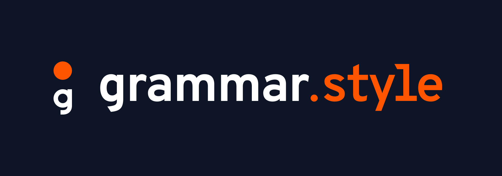

<div align="center" style="margin-bottom: 2rem;padding:2rem;background:#0D1526;color:#fff;">
  

<a id="top"></a>

  <h1 style="border:none;">Design is a language. Governance is its grammar.</h1>
  <p style="font-size: 1.25rem; opacity:0.75;">The TypeScript engine for design system architects who prioritize enforcement over flexibility.</p>
  <p>
    
    
    
    
  </p>
</div>

Build your design tokens once, and map them instantly into your favorite styling tools with strictly typed, auto-completing safety. Stop writing runtime token interpolations and embrace statically generated, strictly verified CSS variables.

## 📖 Table of Contents

- [Getting Started](#-getting-started)
- [Concept: `defineGrammar`](#-concept-definegrammar)
- [Built-in Primitives: `size`](#-built-in-primitives-size)
- [Options](#️-options)
- [Primitives](#-primitives)
- [Semantics](#-semantics)
- [Modes](#-modes)
- [Responsive](#-responsive)
- [The Power of `token()`](#-the-power-of-token)
- [Media Queries: `media` & `breakpoint`](#-media-queries-media--breakpoint)
- [Adapters](#️-adapters)

## 🚀 Getting Started

```bash
npm install grammar-style
```

Generate a `grammar.config.ts` boilerplate file right in your project:

```bash
npx grammar-init
```

If you are using strict zero-runtime sandboxed libraries (like Linaria or Vanilla Extract) and want to use the global `media` exports, generate your cached tokens:

```bash
npx grammar-style generate
```

> 💡 **Pro-Tip: Chain the Generator!**
> Because `media` breakpoints are globally cached in your `node_modules`, you should automate this. Add it to your `package.json` scripts so they regenerate automatically every time you start your development server!
> ```json
> {
>   "scripts": {
>     "dev": "grammar-style generate && <your-framework-dev-command>",
>     "build": "grammar-style generate && <your-framework-build-command>"
>   }
> }
> ```

## 📓 Concept: `defineGrammar`

The core of `grammar-style` is `defineGrammar`, the typed definition engine. Design systems often suffer from disconnected tokens across different surfaces. `defineGrammar` forces your config to strongly adhere to two layers: **Primitives** and **Semantics**.

- **Primitives** are raw values (your Hex hues, absolute spacings, etc).
- **Semantics** are contextual mappings describing _how_ those primitives apply to your UI (e.g. `brand.primary`).

By enforcing this separating structure, any invalid mapping simply fails your TS compiler!

```typescript
import { defineGrammar } from "grammar-style"

export const config = defineGrammar({
  primitives: {
    color: {
      stone: {
        900: "#1A1A1A",
        100: "#E6E6E6",
      },
      brand: "#FF007F",
    },
  },
  semantics: {
    color: {
      background: "color.stone.100",
      surface: "color.stone.900",
      primary: "color.brand",
    },
  },
})

// Binds autocomplete safely everywhere
declare module "grammar-style" {
  export interface Register {
    theme: typeof config
  }
}
```

<a href="#top">⬆️ Back to Top</a>

## 📏 Built-in Primitives: `size`

The `size` primitive is special. It acts as a pre-populated grid scale built perfectly around strict UI layouts.

### The `px` to `rem` Bridge

You access tokens using developer-friendly pixel numbers (e.g. `size.16`), but the _compiled output_ strictly emits natively responsive rems (`var(--size-16)` → `1rem`). This gives you the mental clarity of working with absolute layouts without sacrificing the fluid scalability and accessibility of generic `rem` units.

### Allowed Constraints

Grid sizes map tightly. Small sizes allowed are: `1, 2, 4, 6, 8, 10, 12, 16`. Beyond that, all sizes must be multiples of 4 up to `3000`. You can't enter `size.15` as it breaks the rules of structural scaling!

### Mathematical Negatives

`grammar-style` uniquely supports dynamic negative polarity without duplicating tokens.

`-size.16` = `calc(var(--size-16) * -1)` = `calc(1rem * -1)` = `-1rem`

### Zero-Bloat CSS

Because injecting 700+ size variables into global CSS hurts performance, `grammar-style` runs a lightning-fast static AST file scanner. It explicitly tree-shakes your Next.js/React filesystem and _only_ outputs CSS variables into `:root` for the exact sizes actively used in your codebase. This CSS tree correctly mounts via your adapter framework natively!

<a href="#top">⬆️ Back to Top</a>

## 🎛️ Options

The `options` block lets you overwrite the core rules of your token validation.

| Option        | Default Value                                                                                        | Description                                                                                                                                                                                                                                                                                                  |
| :------------ | :--------------------------------------------------------------------------------------------------- | :----------------------------------------------------------------------------------------------------------------------------------------------------------------------------------------------------------------------------------------------------------------------------------------------------------- |
| `content`     | `"./src"`<br>`"./app"`<br>`"./pages"`<br>`"./components"`<br>`"./lib"`                               | Tells the static AST scanner exactly which directories it should dynamically analyze to pick up and pre-calculate tokens.                                                                                                                                                                                    |
| `opacities`   | `[10, 20, 40, 60, 80, 100]`                                                                          | Restricts allowed transparency fractions. Supply an array of mapping numerals (e.g. `[10, 50]`) to redefine opacity strings natively (`/10`, `/50`) across your semantic object bindings.                                                                                                                    |
| `breakpoints` | `sm: "size.640"`<br>`md: "size.768"`<br>`lg: "size.1024"`<br>`xl: "size.1280"`<br>`xxl: "size.1536"` | Standard responsive layout endpoints. Implicitly generates **Max** variants for every key natively (e.g. `lgMax` safely maps to scaling `rem` math emitting `max-width: calc(64rem - 1px)` to avoid cross-breakpoint layout collisions natively). Map exclusively to custom `size.*` primitives to override. |
| `modes`       | `["dark", "light"]`                                                                                  | Strings enforcing structurally validated root wrapper themes mapping safely toward conditional CSS elements natively like `[data-theme="dark"]`.                                                                                                                                                             |

```javascript
import { defineGrammar } from "grammar-style"

export const config = defineGrammar({
  options: {
    // Configures the AST tracker globally
    content: ["./src/**/*.{ts,tsx}", "./app/**/*.{ts,tsx}"],
    // Customizes the opacity scale to allow /5 and /50 fractions
    opacities: [5, 10, 20, 40, 50, 60, 80, 100],
    // Allows deep validation for explicit alternative root subsets
    modes: ["dark", "light", "high-contrast"],
    // Overrides default layout boundaries perfectly mapped to structural `size.*` grids
    breakpoints: {
      md: "size.800",
      lg: "size.1000",
      xl: "size.1200",
    },
  },
  // ...
})
```

### Overriding Breakpoints

If you override a natively defined breakpoint key (e.g. `lg: "size.1400"`), `grammar-style` perfectly preserves all other structural keys while safely calculating and generating your new `lgMax` fluid mapping fallback locally!

However, if your configuration injects _custom keys_ completely ignoring the native boundaries (e.g. `palm: "size.600"`), the compiler intelligently infers that you want to rewrite your layout rules from scratch. It effortlessly builds and spins up your custom `palmMax` scaling, but fully purges the standard `sm`, `md`, `lg` targets. This gives you a pristine Typescript autocomplete interface completely devoid of bloat or leftover unused defaults.

<a href="#top">⬆️ Back to Top</a>

## 🧱 Primitives

The foundation structural layer. Here you dictate your hardcoded absolute properties—like your hex swatches (`#ff0000`), spacing logic, or unconstrained radii layers. You map these as standard nested objects (e.g. `border: { radius: "size.24" }`).

```typescript
export const config = defineGrammar({
  // ...
  primitives: {
    color: {
      stone: {
        900: "#1A1A1A",
        500: "#808080",
        100: "#E6E6E6",
      },
      brand: "#FF007F",
    },
    shadow: {
      soft: "0 size.4 size.12 -size.4 color.stone.900/10",
      hard: "0 size.8 size.24 color.stone.900/25",
    },
  },
  // ...
})
```

<a href="#top">⬆️ Back to Top</a>

## 🧠 Semantics

Your contextual intent mapping. Semantic mappings **cannot** resolve to hardcoded string strings—they must actively route to valid underlying Primitive dot-paths.

### Deep Nesting

Configure categorized hierarchies to build logical taxonomies like `primitives.color.blue.900`. The TS compiler elegantly tracks every deeply nested layer natively, strictly enforcing your semantic lookups via concatenated `dot.path` string identifiers (e.g. `"color.blue.900"`).

### Dynamic Color Opacities

You can invoke opacity fractions directly on your token paths. For example, mapping `"color.brand/50"` automatically converts the underlying primitive to an `rgba()` CSS variable with `0.5` opacity statically.

```typescript
export const config = defineGrammar({
  //...
  semantics: {
    color: {
      surface: {
        // Evaluate into deep mapping layers effortlessly!
        elevated: "color.stone.900",
        inset: "color.stone.100",
      },
      // You can mix and match custom deeply nested paths alongside logic tokens seamlessly
      text: {
        muted: "color.stone.500",
        accent: "color.brand/50",
      },
    },
  },
})
```

<a href="#top">⬆️ Back to Top</a>

## 🌓 Modes

Use the `modes` object to map dark mode, high contrast, or unique theme variants natively. Simply provide a TypeScript-enforced deep-partial of your `semantics` object inside `modes: { dark: { ... } }`. `grammar-style` will automatically emit these overrides bound tightly behind native `[data-theme="dark"] { ... }` wrappers in your CSS output.

```typescript
export const config = defineGrammar({
  //...
  modes: {
    // Automatically wraps CSS emissions in [data-theme="dark"]
    // Deep validations bind ensuring you match the identical nested structure found in semantics!
    dark: {
      color: {
        surface: {
          elevated: "color.stone.100", // Strict primitive dot-path boundary checks
          inset: "color.stone.900",
        },
      },
    },
  },
})
```

<a href="#top">⬆️ Back to Top</a>

## 📱 Responsive

Handle media queries across standardized boundaries by partially overriding semantics exactly like `modes`.

```typescript
export const config = defineGrammar({
  //...
  semantics: {
    spacing: {
      base: "size.24",
      half: "size.12",
      double: "size.48",
    },
  },
  responsive: {
    // The `<key>Max` sub-variant was natively mapped and injected!
    mdMax: {
      spacing: {
        base: "size.20",
        half: "size.10",
        double: "size.40",
      },
    },
    // The explicit endpoint targets `@media (min-width: ...)` maps exactly as expected!
    lg: {
      spacing: {
        base: "size.32",
        half: "size.16",
        double: "size.64",
      },
    },
  },
})
```

<a href="#top">⬆️ Back to Top</a>

## 🎨 The Power of `token()`

Once your grammar is defined, you'll need to safely consume those tokens inside your standard components. The `token()` utility translates your Typescript semantic paths exactly into the native CSS variables `grammar-style` constructs under the hood.

**Why use it?**

- **100% Type-Safe**: It throws compilation errors if you misspell a path, preventing "silent styling failures."
- **Zero Runtime Overhead**: It evaluates tokens synchronously into native declarative CSS `var()` maps.
- **Dynamic Opacities & Native Math**: You can composite standard CSS expressions natively inside a single string (`token("color.brand/50")`, `token("-size.400")`, or even isolated functions like `token("calc(size.400 * 2)")`). The engine safely parses, resolves, and constructs the necessary variable structures during compilation without bloating your DOM with extra utility classes!

### 1. Template Strings (Linaria, Styled Components, Emotion)

```typescript
const Box = styled.div`
  /* Emits: var(--color-surface-50) */
  color: ${token("color.surface/50")};

  /* Emits: calc(var(--size-400) * 2) */
  margin: ${token("calc(size.400 * 2)")};

  /* Emits: calc(var(--size-400) * -1) */
  bottom: ${token("-size.400")};
`
```

### 2. Object Styles (Vanilla Extract, StyleX, Panda CSS, Emotion)

```typescript
export const boxStyle = style({
  color: token("color.surface/50"),
  margin: token("calc(size.400 * 2)"),
  bottom: token("-size.400"),
})
```

### 3. Inline React Styling

```tsx
export const Box = () => (
  <div style={{ color: token("color.brand/50") }}>
    Safely typed static inline styles!
  </div>
)
```

<a href="#top">⬆️ Back to Top</a>

## 📐 Media Queries: `media` & `breakpoint`

In addition to `token()`, `grammar-style` natively exposes a `media` object directly from the root package. It is a Proxy that lazily inspects your `grammar.config` breakpoints and automatically evaluates them into properly formatted, reusable `@media` query strings.

> **⚠️ Strict Sandbox Warning (Linaria, Vanilla Extract, Next.js):**
> If your styling framework restricts Node built-ins (`fs`, `jiti`) during compilation, importing `media` directly will throw a Sandbox Error. To fix this, run `npx grammar-style generate` (or add it to your `package.json` dev script) to dump a statically readable token cache!

For CSS-in-JS libraries that use object syntax and expect raw condition strings (like Vanilla Extract or StyleX) instead of full `@media` wrappers, we also export a native `breakpoint` object.

### 1. Template Strings (Linaria, Styled Components)

```typescript
import { media, token } from "grammar-style"

export const Footer = styled.footer`
  /* Emits correctly formatted AST `@media` tag! */
  ${media.lg} {
    padding: ${token("size.16")};
  }
`
```

### 2. Object Syntax (Vanilla Extract, StyleX, Emotion)

```typescript
import { breakpoint, token } from "grammar-style"

export const boxStyle = style({
  "@media": {
    /* Emits strictly the condition block: `(min-width: 62.5rem)` */
    [breakpoint.lg]: {
      padding: token("size.32"),
    },
  },
})
```

> **Want to see full architecture breakdowns?** Check out the [Media Queries Documentation](./docs/media.md) for full implementation guides spanning Vanilla Extract, StyleX, Emotion, Linaria, and more alongside deep dives into Client-Side restrictions and explicit lazy-caching rules!

<a href="#top">⬆️ Back to Top</a>

## ⚙️ Adapters

`grammar-style` is framework-agnostic. We don't care what compiler you use to handle your resulting string literals. We offer out-of-the-box **Adapters** to inject your `grammar.config.ts` into multiple major styling frameworks seamlessly.

**Why adapters?**
Most styling tools (like Tailwind, Panda, Linaria, StyleX) require tokens to be formatted and nested into _their_ specific compiler shape. Instead of rewriting your tokens four times for four different compilers over the lifetime of a project, build your dictionary heavily once in `defineGrammar` and export it into your runtime compiler framework instantly.

Available natively out-of-the-box:

- [Tailwind CSS](./docs/adapters.md#1-tailwind-css)
- [Panda CSS](./docs/adapters.md#6-panda-css)
- [Styled Components](./docs/adapters.md#2-styled-components)
- [Emotion](./docs/adapters.md#3-emotion)
- [Vanilla Extract](./docs/adapters.md#4-vanilla-extract)
- [StyleX](./docs/adapters.md#5-stylex)
- [Linaria](./docs/adapters.md#7-linaria)

Just drop the adapter directly into your framework's provider or config plugin layer and move on to building your application!

### 🔒 Strict Sandbox Mode (Optional)
If your framework evaluates code in a strictly isolated AST sandbox (like Linaria or Vanilla-Extract inside Next.js/Vite) that bans Node.js disk reading, you can optionally pass your config object **explicitly** into any adapter to completely bypass dynamic disk reads!
```typescript
import config from "../../grammar.config.ts"
const grammar = createLinariaTheme(config)
```

### Example 1: Tailwind CSS

Drop `grammar-style` natively into your `tailwind.config.ts` configuration to seamlessly map all semantic variables and base primitives into standard Tailwind utility classes (e.g., `text-primary`, `mt-brand`, `rounded-soft`).

```typescript
// tailwind.config.ts
import { createTailwindTheme } from "grammar-style/adapters"

// grammar-style automatically reads your local grammar.config.ts!
const grammar = createTailwindTheme()

export default {
  content: ["./src/**/*.{js,ts,jsx,tsx}"],
  theme: grammar.theme,
}
```

### Example 2: Panda CSS

Consume natively transformed objects safely into Panda's strict static definitions mapping. Because Panda compiles natively at build-time, you securely extend your `panda.config.ts` effortlessly!

```typescript
// panda.config.ts
import { defineConfig } from "@pandacss/dev"
import { createPandaTheme } from "grammar-style/adapters"

const grammar = createPandaTheme()

export default defineConfig({
  // ...
  theme: {
    extend: {
      tokens: grammar.panda.primitives,
      semanticTokens: grammar.panda.semantics,
    },
  },
})
```

> **Using something else?** Check out the [Adapters Documentation](./docs/adapters.md) for full implementation guides spanning Styled Components, Vanilla Extract, StyleX, Emotion, and Linaria!

<a href="#top">⬆️ Back to Top</a>

<div align="center">
  <hr style="margin-block:2rem;" />
  <p></p>

  <h3>A zero-runtime, framework-agnostic token resolution engine for design systems.</h3>
</div>
